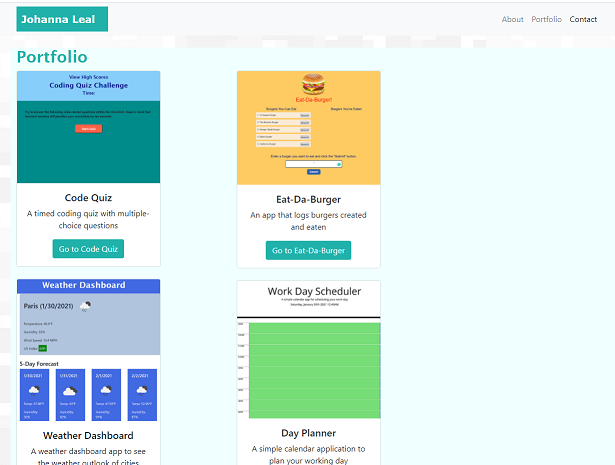

# responsive-portfolio

## Description

In this homework, I updated my portfolio page from my responsive portfolio page to include images of my past homeworks.

## Functionality

* Each page has a basic Bootstrap nav bar, page header, and responsive layout.
* The index.html includes an image of me, a blurb about me, and sidebar with links to GitHub, LinkedIn, and a link to download my resume in PDF format.
* The portfolio.html page consists of screenshots of five projects that I have completed.
* Each image is also a link to the deployed web page of each project.
* The contact.html page contains several input fields and a submit button.

## Installation

This project requires the following files and folders:

* index.html
* portfolio.html
* contact.html
* assets/css/style.css
* assets/images/GitHub-Mark-64px.png
* assets/images/In-Blue-Logo-original.png
* assets/images/profile-pic.jpg

## Deployed Website

[Responsive Portfolio Website](https://johannaleal.github.io/updated-portfolio-page/)

## Repository

[Repository](https://github.com/johannaleal/updated-portfolio-page)

## Index.html Page

## Portfolio Page

## Contact Page

